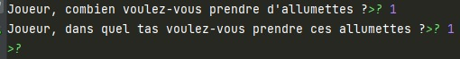
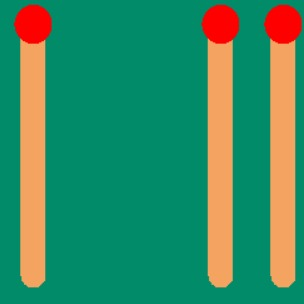

# Journal déroulement projet

## Mercredi 7 décembre

Début du projet. Définitions de différentes fonctions : 
* `enleverAllumettes`, permettant de demander à l'utilisateur combien il veut enlever d'allumettes
* `afficherAllumettes`, qui permet d'afficher les allumettes restantes
* `jeuPossible`, qui permet de vérifier s'il est encore possible de joueur en fonction de la règle
* `tirageOrdi`, pour que l'ordinateur joue

Ainsi que le programme principal contenant une boucle pour jouer tant qu'il reste des allumettes.

## Jeudi 8 décembre

Ajout fonction testNombre, pour prendre des inputs tant qu'ils ne peuvent pas être convertis en nombre.
La boucle principale est mise dans une fonction appelée `jeu`.

 🚧 **Problème détecté** : le jeu s'arrête prématurément, en disant que le jeu ne peut plus continuer, car aucun des choix de la règle ne permet d'enlever des allumettes, et qu'il y a donc match nul. Pas d'idée sur l'origine du problème.

## Vendredi 9 décembre

⏳ Après quelques tests, il semble que le problème trouvé la veille vienne de la fonction `jeuPossible`, qui renvoie la condition inverse de ce qu'elle devrait renvoyer. La condition de `jeuPossible` est donc inversée.

Ajout d'une fonction `genererRegle` qui permet de générer une règle aléatoire à chaque partie.

Ajout de documentation.

## Samedi 10 décembre

Changement de documentation, ajout de quelques commentaires expliquant les étapes principales du code

Ajout des deux prénoms au début du fichier comme demandé.

🖥️ Test des différentes fonctions, selon différents scénarios (match nul, ordinateur gagnant et joueur gagnant). Aucun problème détecté.

## Lundi 12 décembre
Loïc : changement testNombre()

Mathieu : changement comportement fin lorsqu'il n'y a plus assez d'allumettes

Ensemble : Début d'affichage : fond , allumettes(paquets)

**Soir**

Mathieu : Test boucle principale dans `allumettes.py`.

Conclusions : 

* Il manque l'affichage dans turtle d'un émoji à la fin
* Les allumettes ne sont pas assez grandes.

## Mardi 13 décembre
Mathieu : affichage émoji couronne fin.

Mathieu + Loïc : 
* changement affichage allumettes
* définition taille d'écran

Mathieu : centrage des allumettes

Loïc : changement de la couleur des allumettes

🚧 **Problème détecté** : Une tortue s'affiche tout le temps en plein milieu, résolu en utilisant `hideturtle`.

Mathieu et Loïc : révision et ajout de documentation dans le fichier principal `allumettes` et le module `affichage`.

## Dimanche 18 décembre

Mathieu + Loïc : création du fond et des éléments représentant les allumettes prises et restantes

## Mercredi 21 décembre

Mathieu : ajout du système de tas

🚧 **Problèmes détectés** : Le programme demande parfois des entrées au moment de choisir des allumettes puis s'arrête
prématurément, sans aucun message d'erreur.

De plus, il semblerait que le jeu n'enlève pas toujours toutes les allumettes demandées tout le temps

**TODO** (Mathieu) :

* Chercher origine problème et le résoudre ----> Semble résolu en changeant une seule ligne dans tirageOrdi. A
  surveiller.